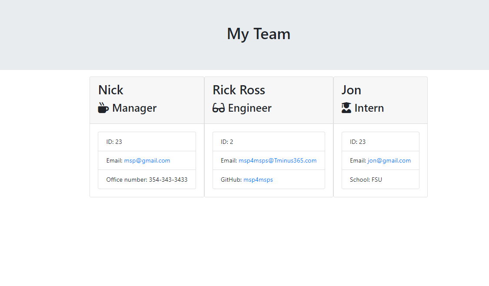

# TEAM PROFILE GENERATOR

[](https://github.com/msp4msps)
[](https://github.com/msp4msps/team_profile_generator)
[](https://github.com/msp4msps/team_profile_generator)
[](https://choosealicense.com/licenses/mit/)

## Table of Content

- [ Project Links ](#Project-Links)
- [ Screenshots](#Screenshots)
- [ Project Description ](#Project-Description)
- [ User Story ](#User-Story)
- [ Technologies ](#Technologies)
- [ Installation ](#Installation)
- [ Usage ](#Usage)
- [ Credits and Reference ](#Credits-and-Reference)
- [ Tests ](#Tests)
- [ Contributing ](#Contributing)
- [ Questions ](#Questions)
- [ License ](#License)

#

## Project Links

https://github.com/msp4msps/team_profile_generator<br>

## Screenshots-Demo

<kbd></kbd><kbd></kbd>

## Project Description

Node.js command-line application that takes in information about employees on a software engineering team, then generates an HTML webpage that displays summaries for each person.

## User Story

As a manager, I want to generate a webpage that displays my teams basic info so that I have quick access to their emails and GitHub profiles

## Technologies

```
Node.js, Javascript, Jest
```

## Installation

Clone the Repo Locally

## Usage

Run node index.js

## Credits and Reference

N/A

## Tests

Clone locally and run node index.js

## Contributing

Open a pull request

## Questions

Contact Me!
Contact the author with any questions!<br>
Github link: [msp4msps](https://github.com/msp4msps)<br>
Email: msp4msps@tminus365.com

## License

This project is [MIT](https://choosealicense.com/licenses/mit/) licensed.<br />
Copyright © 2021 [NICK ROSS](https://github.com/msp4msps)
